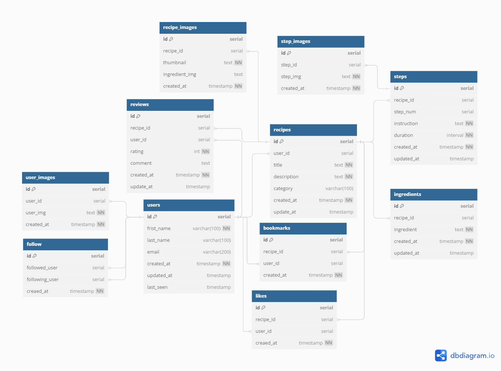

# Welcome

## **Backend Implementation Doc**

* [DBdiragram](https://dbdiagram.io/d/Recipes-66545dabb65d933879c25a67) config

```sql
Table recipes {
  id serial [pk]
  user_id serial [ref: > users.id]
  title text
  description text
  img text
  category varchar(100)
  created_at timestamp
  update_at timestamp

}

Table steps {
  id serial [pk]
  recipe_id serial [ref: > recipes.id]
  step_num int
  instruction text
  created_at timestamp
  updated_at timestamp

}

Table ingredients {
  id serial [pk]
  recipe_id serial [ref: > recipes.id]
  ingredient text
  created_at timestamp
  updated_at timestamp

}

Table users {
  id serial [pk]
  frist_name varchar(100)
  last_name varchar(100)
  created_at timestamp
  updated_at timestamp
  last_seen timestamp

}

Table bookmarks {
  id serial [pk]
  recipe_id serial [ref: > recipes.id]
  user_id serial [ref: > users.id]
  created_at timestamp

}

Table follows {
  id serial [pk]
  followed_user serial [ ref: > users.id]
  following_user serial [ ref: > users.id]
  creaed_at timestamp

}

Table likes {
  id serial [pk]
  recipe_id serial [ ref: > recipes.id]
  user_id serial [ ref: > users.id]
  creaed_at timestamp

}

Table reviews {
  id serial [pk]
  recipe_id serial [ ref: > recipes.id]
  user_id serial [ ref: > users.id]
  rating int
  comment text
  creaed_at timestamp
  update_at timestamp
  
}
```


